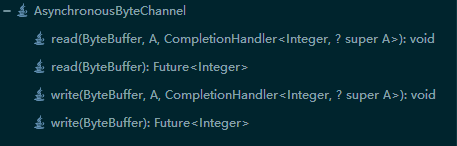

### Channel接口的子接口

在JDK1.8版本中，Channel接口具有11个子接口：

1. AsynchronousChannel
2. AsynchronousByteChannel
3. ReadableByteChannel
4. ScatteringByteChannel
5. WritableByteChannel
6. GatheringByteChannel
7. ByteChannel
8. SeekableByteChannel
9. NetworkChannel
10. MulticastChannel
11. InterruptibleChannel

#### AsynchronousChannel接口介绍

AsynchronousChannel 接口的主要作用是使通道支持异步I/O操作。异步I/O操作有以下两种方式进行实现：

1. 方法

```java
Future<V> operation(...)
```

operation代表I/O操作的名称，大多数是读或写操作。泛型变量V代表经过I/O操作后返回结果的数据类型。使用Future对象可以用于检测I/O操作是否完成，或者等待完成，以及用于接口I/O操作处理后的结果。

2. 回调

```java
void operation(... A attachment, CompletionHandler<V,? super A> handler)
```

A类型对象 attachment 的主要作用是让外部与 CompletionHandler 对象内部进行通信。使用 CompletionHandler 回调的方式实现异步 I/O 操作的优点是 CompletionHandler 对象可以被复用。当 I/O 操作成功或者失败时，CompletionHandler对象中的指定方法会被调用。

异步通道在多线程并发的情况下是线程安全的。某些通道的实现是可以支持并发读和写的，但是不允许在一个未完成的I/O操作上再次调用read或write操作。

在调用cancel()方法以取消读或写操作时，建议废弃I/O操作中使用的所有缓冲区，因为缓冲区中的数据并不是完整的，如果再次打开通道，那么也要尽量避免访问这些缓冲区。

#### AsynchronousByteChannel接口介绍

AsynchronousByteChannel 接口的主要作用是使通道支持异步 I/O 操作，操作单位是字节。



ByteBuffers 类不是线程安全的，尽量保证在对其进行读写操作时，没有其他线程一同进行读写操作。

#### ReadableByteChannel接口介绍

ReadableByteChannel 接口的主要作用是使通道允许对字节进行读操作。


ReadableByteChannel 接口只允许有 1 个读操作进行。如果1个线程正在1个通道上执行1个read()操作，那么任何试图发起另一个read()操作的线程都会被阻塞，直到第1个read()操作完成。

通道只接受以字节为单位的数据处理，因为通道和操作系统进行交互时，操作系统只接受字节数据。

#### ScatteringByteChannel接口介绍

ScatteringByteChannel 接口的主要作用是可以从通道中读取字节到多个缓冲区中。

#### WritableByteChannel 接口介绍

WritableByteChannel 接口的主要作用是使通道允许对字节进行写操作。

WritableByteChannel 接口只允许有1个写操作在进行。如果1个线程正在1个通道上执行1个write()操作，那么任何试图发起另一个write()操作的线程都会被阻塞，直到第1个write()操作完成。其他类型的I/O操作是否可以与write()操作同时进行，取决于通道的类型。

WritableByteChannel接口有以下2个特点：

1. 将1个字节缓冲区中的字节序列写入通道的当前位置
2. write(ByteBuffer)方法是同步的

#### GatheringByteChannel 接口介绍

GatheringByteChannel 接口主要作用是可以将多个缓冲区中的数据写入到通道中。

#### ByteChannel 接口介绍

ByteChannel 接口的主要作用是将 ReadableByteChannel （可读字节通道）与 WritableByteChannel （可写字节通道）的规范进行统一，也就是 ByteChannel 接口的父接口就是 ReadableByteChannel 和 WritableByteChannel。ByteChannel 接口没有添加任何的新方法。ByteChannel接口的实现类就具有了读和写的方法，是双向的操作，而单独地实现ReadableByteChannel 或 WritableByteChannel 接口就是单向的操作，因为实现类只能进行读操作，或者只能进行写操作。

#### SeekableByteChannel 接口介绍

SeekableByteChannel 接口的主要作用是在字节通道中维护position（位置），以及允许 position 发生改变。

#### NetworkChannel 接口介绍

NetworkChannel 接口的主要作用是使通道与Socket进行关联，使通道中的数据能在Socket技术上进行传输。该接口的 bind() 方法用于将 Socket 绑定到本地地址， getLocalAddress() 方法返回绑定到此 Socket 的 SocketAddress 对象，并可以结合 setOption() 和 getOption() 方法用于设置和查询 Socket 相关的选项。

#### MulticastChannel 接口介绍

MulticastChannel 接口的主要作用是使通道支持 Internet Protocal(IP) 多播。IP多播就是将多个主机地址进行打包，形成一个组（group），然后将IP报文向这个组进行发送，也就相当于同时向多个主机传输数据。

#### InterruptibleChannel 接口介绍

InterruptibleChannel 接口的主要作用是使通道能以异步的方式进行关闭与中断。

### FileChannel 类使用

FileChannel 类的主要作用是读取、写入、映射和操作文件的通道。该通道永远是阻塞的操作。

获取FileChannel的方式，通过FileInputStream、FileOutputStream或RandomAccessFile对象获得文件通过，方法是调用该对象的`getChannel()`方法。

#### 方法

1. int write(ByteBuffer src) 将remaining字节序列从给定的缓冲区写入此通道的当前位置，此方法的行为与WritableByteChannel接口所指定的行为完全相同：在任意给定时刻，一个可写入通道上只能进行一个写入操作。是**同步的**。

2.  int read(ByteBuffer dst) 将字节序列从此通道的当前位置读入给定的缓冲区的当前位置。此方法的行为与ReadableByteChannel接口所指定的行为完全相同：在任意给定时刻，一个可读取通道上只能进行一个读取操作。ByteBuffer缓冲区 remaining 为多少，就从通道中读多少字节的数据。

3. long write(ByteBuffer[] srcs) 将每个缓冲区的 remaining 字节序列写入此通道的当前位置。

4. long read(ByteBuffer[] dsts) 将字节序列从此通道读入给定的缓冲区数组中的第0个缓冲区的当前位置。将通道当前位置的字节序列读入多个ByteBuffer缓冲区的 remaining 剩余空间中。

5. long write(ByteBuffer[] srcs, int offset, int length) 以指定缓冲区数组的 offset 下标开始，向后使用 length 个字节缓冲区，再将每个缓冲区的 remaining 剩余字节子序列写入此通道的当前位置。

   参数说明：

   offset：第一个缓冲区（要获取该缓冲区中的字节）在缓冲区数组中的偏移量；必须为非负数并且不能大于 srcs.length。

   length：要访问的最大缓冲区数；必须为非负数并且不能大于 srcs.length - offset。

6. long read(ByteBuffer[] dsts, int offset, int length) 将通道中当前位置的字节序列读入以下标为offset开始的ByteBuffer[] 数组中的 remaining 剩余空间中，并且连续写入 length 个 ByteBuffer 缓冲区。

7. write(ByteBuffer src, long position) 将缓冲区的remaining 剩余字节序列写入通道的指定位置。此方法**不修改此通道的位置**。如果给定的位置大于该文件的当前大小，则该文件将扩大以容纳新的字节；在以前文件末尾和新写入字节之间的字节值是未指定的。**是同步的。**

8. read(ByteBuffer dst, long position) 将通道的指定位置的字节序列读入给定的缓冲区的当前位置。参数dst代表要向其中传输字节的缓冲区。position代表开始传输的**文件位置**，必须为非负数。从给定的文件位置开始读取各字节，而不是从该通道的当前位置。如果给定的位置大于该文件的当前大小，则不读取任何字节。是同步的。

9. position(long newPosition) 设置此通道的**文件位置**。

10. long size() 返回此通道关联文件的当前大小。

11. truncate(long size) 将此通道的文件截取为给定大小。 如果此通道的文件位置大于给定大小，则将位置设置为该大小。

12. longtransferTo(long position, long count, WritableByteChannel target) 将字节从此通道的文件传输到给定的可写入字节通道。此方法不修改此通道的位置。

13. long transferFrom(ReadableByteChannel src, long position, long count) 将字节从给定的可读取字节通道传输到此通道的文件中。此方法不修改此通道的位置。

14. FileLock lock(long position, long size, boolean shared) 获取此通道的文件给定区域上的锁定。文件锁定是以整个Java虚拟机来保持的。

15. FileLock lock() 获取此通道的文件的独占锁定，是对文件的整体进行锁定。

16. FileLock tryLock(long position, long size, boolean shared)  试图获取对此通道的文件给定区域的锁定。此方法不会阻塞。

17. FileLock tryLock() 获取对此通道的文件的独占锁定，是对文件的整体进行锁定。

18. void force(boolean metaData) 强制将所有对此通道的文件更新写入包含该文件的存储设备中。如果此通道的文件驻留在本地存储设备上，则此方法返回时可保证：在此通道创建后或在最后一次调用此方法后，对该文件进行的所有更改都已写入该设备中。这对确保在系统崩溃时不会丢失重要信息特别有用。如果该文件不在本设备上，则无法提供这样的保证。

    metaData参数可用于限制此方法必须执行的I/O操作数量。在为此参数传入false时，只需要对文件内容的更新写入存储设备；在传入true时，则必须写入对文件内容和元数据的更新，这通常需要一个以上的I/O操作。此参数是否实际有效，取决于底层操作系统，因此是未指定的。

    调用此方法可能导致发生I/O操作，即使该通道仅允许进行读取操作时也是如此。

    此方法只保证强制进行通过此类中已定义的方法对此通道的文件所进行的更改。此方法不一定强制进行那些通过修改已映射字节缓冲区（通过调用map()方法获得）的内容所进行的更改。
    
    其实在调用FileChannel类的write()方法时，操作系统为了运行的效率，先是把那些保存到硬盘上的数据暂时放入操作系统内核的缓存中，以减少硬盘的读写次数，然后在某一个时间点再将内核缓存中的数据批量地同步到硬盘中，但同步的时间却是由操作系统决定的，因为时间是未知的，这时就不能让操作系统来决定，所以要显式地调用force()方法来强制进行同步，这样做的目的是防止在系统崩溃或断电时缓存中的数据丢失而造成损失。但是，force(boolean) 方法**并不能完全保证数据不丢失**，如果在执行force()方法时出现断电的情况，那么硬盘上的数据有可能就不是完整的，而且由于断电地原因导致内核缓存中的数据也丢失了，最终造成的结果就是force(boolean)方法执行了，数据也有可能丢失。那么该方法的最终目的是什么呢？其实force(boolean)方法的最终目的是**尽最大的努力减少**数据的丢失。

19. MappedByteBuffer map(FileChannel.MapMode mode, long position, long size) 将此通道的文件区域直接映射到内存中。position是指**文件中的位置**。

    映射关系一经创建，就不再依赖于创建它时所用的文件通道。特别是关闭通道对映射关系的有效性没有任何影响。

    很多内存映射文件的细节从根本上是取决于底层操作系统的，因此是未指定的。当请求的区域未完全包含在该通道的文件中时，此方法的行为是未指定的。 对该程序或另一个的底层文件的内容或大小进行的更改是否被传播到缓冲区是未指定的。 缓冲区的更改传播到文件的速率是未指定的。

    对于大多数操作系统而言，与通过普通的read()和write()方法读取或写入数千字节的数据相比，将文件映射到内存中开销更大。从性能的观点来看，通常将相对较大的文件映射到内存中才是值得的。

    3种模式：

    1. 只读：任何尝试修改得到的缓冲区将导致抛出ReadOnlyBufferException 异常。 （ MapMode.READ_ONLY ）
    2. 读/写：对得到的缓冲区的更改将最终传播到文件中; 该更改对映射到同一文件的其他程序不一定是可见的。 （ MapMode.READ_WRITE ）
    3. 专用：对得到的缓冲区的更改不会传播到文件，并且该更改对映射到同一文件的其他程序也不是可见的；相反，会创建缓冲区已修改部分的专用副本。（ MapMode.PRIVATE ）

20. FileChannel open(Path path, OpenOption… options) 打开一个文件，以便对这个文件进行后期处理。

21. public final boolean isOpen() 判断当前的通道是否处于打开的状态。

### MappedByteBuffer  

1. public final MappedByteBuffer force() 

   将此缓冲区所做的内容更改强制写入包含映射文件的存储设备中。

   如果映射到此缓冲区的文件驻留在本地存储设备上，那么当此方法返回时，可以保证自此创建缓冲区创建以来，或是最后一次调用此方法以来，已将对缓冲区所做的所有更改写入到该设备。

   如果文件不在本地设备上，则无法做出这样的保证。

   如果此缓冲区不是以读/写模式（ FileChannel.MapMode.READ_WRITE ）映射的，则调用此方法将**无效**。

2. public final MappedByteBuffer load()

   将此缓冲区的内容加载到物理内存中。

   此方法**尽最大限度**地确保在它返回时，此缓冲区的内容位于物理内存中。 调用此方法可能会导致一些页面错误，并导致I / O操作发生。

3. public final boolean isLoaded()

   判断此缓冲区的内容是否位于物理内存中。

   返回值true意味着此缓冲区中所有数据极有可能都位于物理内存中，因此是可访问的，不会导致任何虚拟内存页错误，也无须任何I/O操作。返回值false不一定意味着缓冲区的内容不位于物理内存中。返回值是一个提示，而不是保证，因为在此方法的调用返回之前，底层操作系统可能已经移出某些缓冲区数据。

### OpenOption

OpenOption接口实现类通常由StandardOpenOption枚举类进行代替。

StandardOpenOption中的枚举常量

| StandardOpenOption | 描述 |
| ------------------ | ------------------------------------------------------------ |
| CREATE             | 创建一个新文件（如果它不存在）。如果还设置了CREATE_NEW选项，则忽略此选项。此选项只是一个创建文件的意图，并不能真正地创建文件，因此，CREATE不能单独使用，那样就会出现java.nio.file.NoSuchFileException异常。 |
| WRITE              | 打开以进行写入访问                                           |
| APPEND             | 打开文件以进行写入访问，则字节写入文件末尾而不是开始处。     |
| READ               | 打开以进行读取访问                                           |
| TRUNCATE_EXISTING  | 如果该文件已存在并且写入访问而打开，则其长度将被截断为0。如果只为读取访问打开文件，则忽略此选项。 |
| CREATE_NEW         | 创建一个新文件，如果该文件已存在，则失败。                   |
| DELETE_ON_CLOSE    | 关闭时删除。当此选项存在时，实现会尽最大努力尝试在关闭时通过适当的close()方法删除该文件。此选项主要用于仅由Java虚拟机的单个实例使用的工作文件。 |
| SPARSE             | 稀疏文件。与CREATE_NEW选项一起使用时，此选项提供了一个提示，表明新文件将是稀疏的。当文件系统不支持创建稀疏文件时，将忽略该选项。 |
| SYNC               | 要求对文件内容或元数据的每次更新都同步写入底层存储设备。如果这样做了，程序运行的效率就降低了。 |
| DSYNC              | 要求对文件内容的每次更新都同步写入底层存储设备。             |

枚举常量SYNC和DSYNC的区别：SYNC更新内容与元数据，而DSYNC只更新内容与force(boolean)方法作用一样。