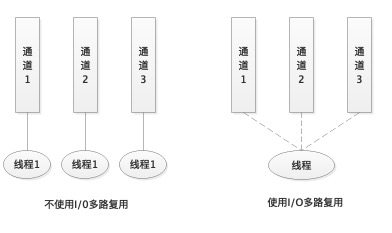

[TOC]

###选择器与I/0多路复用

线程数会随着通道的多少而动态地增减以进行适配，在内部其实并不永远是一个线程，多路复用的核心目的就是使用最少的线程去操作更多的通道。在JDK的源代码中，创建线程的个数是根据通道的数量来决定的，每注册1023个通道就创建1个新的线程，这些线程执行Windows中select()方法来监测系统socket事件，如果发生事件则通知应用层中的main线程终止阻塞，继续向下运行，处理事件。

**注意**

学习I/O多路复用时一定要明白一个知识点，就是在使用I/O多路复用时，这个线程不是以for循环的方式来判断每个通道是否有数据要进行处理，而是以**操作系统层作为“通知器”**，来“通知JVM中的线程”哪个通道中的数据需要进行处理，这点一定要注意。当不使用for循环的方式来进行判断，而是使用通知的方式时，这就大大提高了程序运行的效率，不会出现无限期的for循环迭代空运行了。

### 通道类SelectableChannel的介绍

SelectableChannel 类可以通过选择器实现多路复用。

当SelectableChannel在选择器里注册后，通道在注销之前将一直保持注册状态。需要注意的是，不能直接注销通道，而是通过调用SelectionKey类的`cancel()`方法显式地取消，这将在选择器的下一次选择select()操作期间去注销通道。无论是通过调用通道的close()方法，还是中断阻塞于该通道上I/O操作中的线程来关闭该通道，都会隐式地取消该通道的所有SelectionKey。

如果选择器本身已关闭，则将注销该通道，并且表示其注册的SelectionKey将立即无效。

一个通道至多只能在任意特定选择器上注册一次。可以通过调用isRegistered()方法来确定是否已经向一个或多个选择器注册了某个通道。

SelectableChannel在多线程并发环境下是安全的。

### 通道类ServerSocketChannel

#### 获得ServerSocketChannel与ServerSocket对象

1. public static ServerSocketChannel open()

   打开服务器套接字通道。

   新通道的套接字最初是未绑定的；可以接受连接之前，必须通过它的某个套接字的bind()方法将其绑定到具体的地址。

2. public abstract ServerSocket socket()

   返回ServerSocket类的对象，然后与客户端套接字进行通信。

